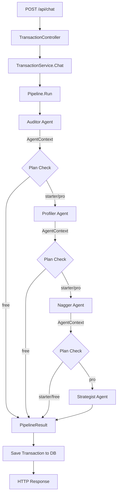

# Design Document: Agentic Finance Workforce

## Overview

This document describes the technical design for transforming the existing `finance-chat` Go API into a multi-agent AI system. The current architecture is a single-path flow: user message → Ollama LLM → parsed `Transaction` → saved to SQLite. The new architecture introduces a composable **Agent Pipeline** where four specialized agents — Auditor, Profiler, Nagger, and Strategist — execute in sequence, each enriching the result before passing it to the next.

The design is additive: existing endpoints, models, and services remain intact. New packages are layered on top, and the `Chat` flow is updated to run through the pipeline instead of calling the LLM directly.

### Key Design Goals

- **Composability**: Each agent is independently testable and replaceable.
- **Plan gating**: Agents are skipped cleanly based on the user's subscription tier.
- **Backward compatibility**: Existing API contracts (`/api/chat`, `/api/transactions`, `/api/analytics`) are preserved.
- **Personality-driven prompts**: Each agent's identity is stored in a configurable struct, not hardcoded in business logic.

---

## Architecture

### High-Level Flow



### Package Structure

The new code lives in an `agent/` package alongside the existing packages. No existing packages are renamed or restructured.

```
finance-chat/
├── agent/
│   ├── agent.go          # Agent interface, AgentContext, AgentResult, Pipeline
│   ├── auditor.go        # Auditor agent implementation
│   ├── profiler.go       # Profiler agent implementation
│   ├── nagger.go         # Nagger agent implementation
│   ├── strategist.go     # Strategist agent implementation
│   └── config.go         # AgentConfig personality structs
├── model/
│   ├── transaction.go    # (existing, unchanged)
│   ├── user_correction.go # (existing, unchanged)
│   ├── behavior_profile.go # NEW: BehaviorProfile, BehaviorDNA
│   └── user_plan.go      # NEW: UserPlan
├── repository/
│   ├── transaction_repository.go   # (existing)
│   ├── correction_repository.go    # (existing)
│   ├── behavior_profile_repository.go # NEW
│   └── user_plan_repository.go     # NEW
├── service/
│   ├── transaction_service.go  # Updated: Chat() runs Pipeline
│   ├── agent_service.go        # NEW: AgentService (list agents, plans, upgrade)
│   ├── ollama_service.go       # (existing, unchanged)
│   └── line_service.go         # (existing, unchanged)
├── controller/
│   ├── transaction_controller.go  # (existing, minor update for PipelineResult)
│   └── agent_controller.go        # NEW: /api/agents, /api/plans, /api/plans/upgrade
├── prompt/
│   └── transaction_prompt.go  # Updated: strict JSON schema, confidence, logic_gate
└── router/
    └── router.go              # Updated: wire new controller + service
```

---

## Components and Interfaces

### Agent Interface (`agent/agent.go`)

```go
package agent

import (
    "finance-chat/model"
    "finance-chat/service"
)

// Agent is the core interface every workforce member must implement.
type Agent interface {
    Name() string
    Run(ctx *AgentContext) (*AgentResult, error)
}

// AgentContext is the shared state passed through the pipeline.
// Each agent reads from and writes to this struct.
type AgentContext struct {
    RawMessage      string
    ParsedTx        *model.ParsedTransactionResult // set by Auditor
    SavedTx         *model.Transaction             // set after DB save
    BehaviorDNA     *model.BehaviorDNA             // set by Profiler
    Alerts          []model.Alert                  // appended by Nagger
    Recommendations []model.Recommendation         // appended by Strategist
    UserPlan        model.PlanName                 // injected before pipeline runs
    LLM             service.LLMClient              // shared LLM client
    LineService     service.LineService            // shared LINE client
}

// AgentResult carries the output of a single agent run.
type AgentResult struct {
    AgentName string
    Data      any    // agent-specific payload (BehaviorDNA, []Alert, etc.)
}

// PipelineResult is the final output returned to the caller.
type PipelineResult struct {
    Transaction     *model.Transaction    `json:"transaction"`
    BehaviorDNA     *model.BehaviorDNA    `json:"behavior_dna,omitempty"`
    Alerts          []model.Alert         `json:"alerts"`
    Recommendations []model.Recommendation `json:"recommendations"`
}

// Pipeline executes a sequence of agents in order.
type Pipeline struct {
    agents []Agent
}

func NewPipeline(agents []Agent) *Pipeline {
    return &Pipeline{agents: agents}
}

func (p *Pipeline) Run(ctx *AgentContext) (*PipelineResult, error) {
    for _, a := range p.agents {
        result, err := a.Run(ctx)
        if err != nil {
            return nil, fmt.Errorf("agent %s failed: %w", a.Name(), err)
        }
        _ = result // context is mutated in-place by each agent
    }
    return &PipelineResult{
        Transaction:     ctx.SavedTx,
        BehaviorDNA:     ctx.BehaviorDNA,
        Alerts:          ctx.Alerts,
        Recommendations: ctx.Recommendations,
    }, nil
}
```

### Agent Config (`agent/config.go`)

Each agent's personality is stored as a struct so prompt text can be updated without touching business logic.

```go
package agent

// AgentConfig holds the identity and prompt template for a single agent.
type AgentConfig struct {
    AgentName    string // e.g. "The Chief Auditor"
    Personality  string // one-line description for the marketplace UI
    SystemPrompt string // full system prompt injected into LLM calls
}

// DefaultConfigs returns the default personality configs for all four agents.
func DefaultConfigs() map[string]AgentConfig {
    return map[string]AgentConfig{
        "auditor":    auditorConfig(),
        "profiler":   profilerConfig(),
        "nagger":     naggerConfig(),
        "strategist": strategistConfig(),
    }
}
```

### Plan Gating

The `Pipeline` is constructed with only the agents the user's plan allows. The `BuildPipeline` factory function handles this:

```go
// BuildPipeline constructs a Pipeline with agents filtered by the user's plan.
func BuildPipeline(plan model.PlanName, deps AgentDeps) *Pipeline {
    auditor := NewAuditorAgent(deps)
    agents := []Agent{auditor}

    if plan == model.PlanStarter || plan == model.PlanPro {
        agents = append(agents, NewProfilerAgent(deps))
        agents = append(agents, NewNaggerAgent(deps))
    }
    if plan == model.PlanPro {
        agents = append(agents, NewStrategistAgent(deps))
    }
    return NewPipeline(agents)
}
```

---

## Data Models

### `model/behavior_profile.go`

```go
package model

import "time"

// BehaviorDNA is the computed behavioral profile for a user.
type BehaviorDNA struct {
    DominantCategory    string   `json:"dominant_category"`
    ImpulseFrequency    int      `json:"impulse_frequency"`     // count in last 30 days
    LuxuryDriftIndex    float64  `json:"luxury_drift_index"`    // % change in discretionary spend
    LuxuryDriftDetected bool     `json:"luxury_drift_detected"` // true if drift > 20%
    TopBrands           []string `json:"top_brands"`            // top 3 by frequency
    InsufficientData    bool     `json:"insufficient_data"`     // true if < 5 transactions
}

// BehaviorProfile is the GORM model persisted to behavior_profiles table.
type BehaviorProfile struct {
    ID           uint      `json:"id"            gorm:"primaryKey;autoIncrement"`
    UserID       string    `json:"user_id"       gorm:"index"`
    ComputedDate time.Time `json:"computed_date"`
    // BehaviorDNA fields flattened for easy querying
    DominantCategory    string  `json:"dominant_category"`
    ImpulseFrequency    int     `json:"impulse_frequency"`
    LuxuryDriftIndex    float64 `json:"luxury_drift_index"`
    LuxuryDriftDetected bool    `json:"luxury_drift_detected"`
    TopBrands           string  `json:"top_brands"` // JSON-encoded []string
    InsufficientData    bool    `json:"insufficient_data"`
    CreatedAt           time.Time `json:"created_at"`
}
```

### `model/user_plan.go`

```go
package model

import "time"

type PlanName string

const (
    PlanFree    PlanName = "free"
    PlanStarter PlanName = "starter"
    PlanPro     PlanName = "pro"
)

// UserPlan persists the user's active subscription.
type UserPlan struct {
    ID        uint      `json:"id"         gorm:"primaryKey;autoIncrement"`
    UserID    string    `json:"user_id"    gorm:"uniqueIndex"`
    Plan      PlanName  `json:"plan"`
    StartDate time.Time `json:"start_date"`
    ExpiryDate time.Time `json:"expiry_date"`
    CreatedAt time.Time `json:"created_at"`
    UpdatedAt time.Time `json:"updated_at"`
}

// IsExpired returns true if the plan's expiry date is in the past.
func (p *UserPlan) IsExpired() bool {
    return time.Now().After(p.ExpiryDate)
}

// EffectivePlan returns the plan name, falling back to free if expired.
func (p *UserPlan) EffectivePlan() PlanName {
    if p.IsExpired() {
        return PlanFree
    }
    return p.Plan
}
```

### `model/alert.go` and `model/recommendation.go`

```go
// Alert is generated by the Nagger agent.
type Alert struct {
    Type        string  `json:"type"`        // "warning", "impulse_flag", "luxury_drift"
    Message     string  `json:"message"`
    Category    string  `json:"category,omitempty"`
    Amount      float64 `json:"amount,omitempty"`
    CategoryAvg float64 `json:"category_avg,omitempty"`
}

// Recommendation is generated by the Strategist agent.
type Recommendation struct {
    Title                string  `json:"title"`
    Description          string  `json:"description"`
    EstimatedMonthlySave float64 `json:"estimated_monthly_save"`
    Priority             string  `json:"priority"` // "high", "medium", "low"
}
```

### Updated `prompt.ParsedTransactionResult`

The existing `ParsedTransaction` struct in `prompt/transaction_prompt.go` already has `confidence` and `logic_gate` fields. The Auditor agent wraps the parsed result with a `LowConfidence` flag:

```go
// ParsedTransactionResult wraps ParsedTransaction with post-parse metadata.
type ParsedTransactionResult struct {
    *prompt.ParsedTransaction
    LowConfidence bool `json:"low_confidence"` // true if confidence < 60
}
```

---

## Prompt Changes

### Auditor Prompt (`agent/auditor.go`)

The `basePrompt()` in `prompt/transaction_prompt.go` is replaced by the Auditor's `AgentConfig.SystemPrompt`. The new prompt enforces a strict JSON schema:

```
You are "The Chief Auditor." Verified. Precise. Terse.

### STRICT OUTPUT CONTRACT
You MUST return ONLY a single JSON object matching this exact schema:
{
  "raw_message":   string,          // the original user input verbatim
  "type":          "income"|"expense",
  "amount":        number,          // positive float, no currency symbols
  "category":      string,          // one of: Food & Beverage, Transport, Bill, Shopping, Health, Entertainment, Other
  "sub_category":  string,
  "brand":         string,
  "behavior_tag":  "impulse"|"necessity"|"social"|"treat"|"recurring",
  "description":   string,
  "logic_gate":    string,          // e.g. "Verified: Uniqlo → Shopping. Shirt → Clothing."
  "confidence":    integer          // 1–100
}

### REJECTION RULES
- If type is not "income" or "expense": REJECT and regenerate.
- If behavior_tag is not in the allowed set: REJECT and regenerate.
- If confidence < 60: set confidence to the actual value; the system will flag for review.
- NEVER omit any field. Missing fields are a protocol violation.

### FEW-SHOT EXAMPLES (Thai context)
...
```

### Validation in Auditor Agent

After parsing, the Auditor calls a `validateParsedTransaction` function that checks all required fields and enum constraints before accepting the result. This replaces the silent defaulting in `Normalize()`.

---

## API Design

### Existing Endpoints (unchanged contract)

| Method | Path | Change |
|--------|------|--------|
| POST | `/api/chat` | Response body gains optional `alerts` and `recommendations` fields from PipelineResult |
| POST | `/api/chat/stream` | Unchanged (streams tokens; final `done` event carries updated Transaction) |
| GET | `/api/analytics` | Mocked values replaced with real DB calculations |
| All others | — | Unchanged |

### New Endpoints

#### `GET /api/agents`

Returns all available agents with their marketplace metadata.

**Response:**
```json
[
  {
    "id": "auditor",
    "name": "The Chief Auditor",
    "personality": "Precise, terse, audit-focused. Speaks in Verified/Rejected/Flagged.",
    "active_on_plan": true
  },
  {
    "id": "profiler",
    "name": "The Profiler",
    "personality": "Analytical, pattern-focused. References behavioral psychology.",
    "active_on_plan": false
  },
  {
    "id": "nagger",
    "name": "The Nagger",
    "personality": "Direct, friction-inducing. Makes you feel the spend.",
    "active_on_plan": false
  },
  {
    "id": "strategist",
    "name": "The Strategist",
    "personality": "Growth-oriented, motivational. Focused on net worth.",
    "active_on_plan": false
  }
]
```

#### `GET /api/plans`

Returns all subscription plans.

**Response:**
```json
[
  {
    "name": "free",
    "price": 0,
    "agents": ["auditor"]
  },
  {
    "name": "starter",
    "price": 99,
    "agents": ["auditor", "profiler", "nagger"]
  },
  {
    "name": "pro",
    "price": 299,
    "agents": ["auditor", "profiler", "nagger", "strategist"]
  }
]
```

#### `POST /api/plans/upgrade`

**Request:**
```json
{ "plan": "starter" }
```

**Response (200):**
```json
{
  "user_id": "default",
  "plan": "starter",
  "start_date": "2025-05-01T00:00:00Z",
  "expiry_date": "2025-06-01T00:00:00Z"
}
```

**Response (400):**
```json
{ "error": "invalid plan name: \"gold\". Valid plans: free, starter, pro" }
```

### Updated Chat Response

`POST /api/chat` response gains pipeline fields:

```json
{
  "transaction": { ... },
  "behavior_dna": { ... },
  "alerts": [
    {
      "type": "warning",
      "message": "You just spent 3× your usual amount on coffee. Intentional?",
      "category": "Food & Beverage",
      "amount": 450,
      "category_avg": 150
    }
  ],
  "recommendations": [
    {
      "title": "Cap Your Coffee Habit",
      "description": "Your impulse coffee purchases are up 5× this month...",
      "estimated_monthly_save": 1200,
      "priority": "high"
    }
  ]
}
```

---

## Analytics Fix

The `GetAnalytics()` method in `service/transaction_service.go` has several hardcoded mock values. The fixes:

| Field | Current | Fix |
|-------|---------|-----|
| `monthly_summary.month` | `"April 2025"` (hardcoded) | `time.Now().Format("January 2006")` |
| `savings_comparison` | hardcoded `{32220, 58.0}` | Query current vs prior calendar month income |
| `expense_comparison` | hardcoded `{22100, -48.0}` | Query current vs prior calendar month expense |
| `behavior_insights` | static strings | Derived from `BehaviorDNA` fields |
| `category_breakdown` | unsorted | Sort by `amount` descending |
| `daily_spending` | unsorted map iteration | Sort by `date` ascending |

The month-over-month comparison logic:

```go
func (s *transactionService) calculateMonthComparison(
    transactions []model.Transaction,
    txType model.TransactionType,
) service.ComparisonMetric {
    now := time.Now()
    currentStart := time.Date(now.Year(), now.Month(), 1, 0, 0, 0, 0, time.UTC)
    priorStart := currentStart.AddDate(0, -1, 0)
    priorEnd := currentStart

    var current, prior float64
    for _, t := range transactions {
        if t.Type != txType {
            continue
        }
        if !t.CreatedAt.Before(currentStart) {
            current += t.Amount
        } else if !t.CreatedAt.Before(priorStart) && t.CreatedAt.Before(priorEnd) {
            prior += t.Amount
        }
    }

    diff := current - prior
    pct := 0.0
    if prior > 0 {
        pct = (diff / prior) * 100
    }
    return service.ComparisonMetric{
        Label:      "vs last month",
        Amount:     diff,
        Percentage: pct,
    }
}
```

---

## Error Handling

| Scenario | Behavior |
|----------|----------|
| Auditor: LLM returns malformed JSON | Return `400`-style error with `"agent auditor failed: no valid JSON found"` |
| Auditor: required field missing | Return structured error naming the missing field |
| Auditor: invalid enum value | Return error naming the field and the invalid value |
| Profiler: DB query fails | Pipeline halts; error propagated to caller |
| Nagger: LINE push fails | Log error with alert type + transaction ID; pipeline continues |
| Strategist: LLM timeout | Return error after 15s context deadline |
| Plan upgrade: invalid plan name | HTTP 400 with descriptive message listing valid plans |
| Plan expired: any pipeline run | `EffectivePlan()` returns `free`; pipeline runs with Auditor only |

All agent errors are wrapped with the agent name using `fmt.Errorf("agent %s failed: %w", a.Name(), err)` so callers can identify the failing stage.

---

## Testing Strategy

### Unit Tests

- `agent/auditor_test.go`: Validate JSON schema enforcement, enum rejection, confidence flag, few-shot prompt content.
- `agent/profiler_test.go`: SurpriseScore formula, BehaviorDNA field computation, insufficient data edge case.
- `agent/nagger_test.go`: Alert generation thresholds, LINE failure non-blocking behavior.
- `agent/strategist_test.go`: Recommendation generation, insufficient data short-circuit.
- `agent/pipeline_test.go`: Execution order, halt-on-error, plan gating.
- `service/transaction_service_test.go`: Analytics real calculations (month comparison, sorting).

### Property-Based Tests

The project uses Go's standard `testing` package. For property-based testing, add [`pgregory.net/rapid`](https://github.com/pgregory/rapid) — a well-maintained Go PBT library with no external dependencies.

Each property test runs a minimum of 100 iterations. Tests are tagged with a comment referencing the design property:

```go
// Feature: agentic-finance-workforce, Property 3: SurpriseScore invariant [0,100]
func TestSurpriseScoreInvariant(t *testing.T) {
    rapid.Check(t, func(t *rapid.T) {
        amount := rapid.Float64Range(0, 1_000_000).Draw(t, "amount")
        avg    := rapid.Float64Range(0, 1_000_000).Draw(t, "avg")
        score  := ComputeSurpriseScore(amount, avg)
        if score < 0 || score > 100 {
            t.Fatalf("SurpriseScore %d out of range [0,100]", score)
        }
    })
}
```

### Integration Tests

- `agent/nagger_integration_test.go`: Mock LINE service, verify push is called per alert.
- `repository/behavior_profile_repository_test.go`: Verify BehaviorProfile persists and retrieves correctly.
- `router/router_test.go`: End-to-end HTTP tests for new endpoints.


---

## Correctness Properties

*A property is a characteristic or behavior that should hold true across all valid executions of a system — essentially, a formal statement about what the system should do. Properties serve as the bridge between human-readable specifications and machine-verifiable correctness guarantees.*

### Property Reflection

Before listing properties, redundant criteria are consolidated:

- Requirements 3.1, 3.2, and 3.7 all concern the SurpriseScore range invariant and formula. They are merged into **Property 3**.
- Requirements 1.2 and 1.3 both concern missing-field validation — 1.3 is the error message content of 1.2. They are merged into **Property 1**.
- Requirements 6.2–6.4 and 6.6 all describe plan-agent inclusion rules. They are merged into **Property 7**.

---

### Property 1: Missing field validation names the absent field

*For any* JSON object that is missing one or more of the required `ParsedTransaction` fields (`raw_message`, `type`, `amount`, `category`, `sub_category`, `brand`, `behavior_tag`, `description`, `logic_gate`, `confidence`), the Auditor's validation function SHALL return an error, and that error message SHALL contain the name of the missing field.

**Validates: Requirements 1.2, 1.3**

---

### Property 2: Type field enum enforcement

*For any* string value that is not exactly `"income"` or `"expense"`, the Auditor's field validator SHALL reject it. *For any* string that is exactly `"income"` or `"expense"`, the validator SHALL accept it.

**Validates: Requirements 1.4**

---

### Property 3: SurpriseScore is always in [0, 100]

*For any* transaction amount (≥ 0) and any 30-day category average (≥ 0), the computed `SurpriseScore` using the formula `min(100, round((amount - avg) / max(avg, 1) * 100))` SHALL always be an integer in the range [0, 100]. Amounts at or below the average SHALL produce a score of 0.

**Validates: Requirements 3.1, 3.2, 3.7**

---

### Property 4: BehaviorDNA insufficient_data flag

*For any* transaction history containing fewer than 5 transactions, the Profiler SHALL return a `BehaviorDNA` where `insufficient_data` is `true` and all numeric metrics (`impulse_frequency`, `luxury_drift_index`) are zero.

**Validates: Requirements 3.6**

---

### Property 5: Luxury drift flag threshold

*For any* `BehaviorDNA` where `luxury_drift_index` exceeds 20.0, `luxury_drift_detected` SHALL be `true`. *For any* `BehaviorDNA` where `luxury_drift_index` is 20.0 or below, `luxury_drift_detected` SHALL be `false`.

**Validates: Requirements 3.4**

---

### Property 6: Nagger alert conditions are exhaustive

*For any* transaction and `BehaviorDNA` combination, the Nagger's alert generation SHALL satisfy all of the following simultaneously:
- If `SurpriseScore` ≥ 70 → a `"warning"` alert is present in the output.
- If `behavior_tag == "impulse"` AND `amount > 500` → an `"impulse_flag"` alert is present.
- If `luxury_drift_detected == true` → a `"luxury_drift"` alert is present.
- If none of the above conditions hold → the alerts list is empty.

**Validates: Requirements 4.1, 4.2, 4.3, 4.7**

---

### Property 7: Plan gating — active agents match plan definition exactly

*For any* user plan (`free`, `starter`, `pro`), the set of agents included in the constructed `Pipeline` SHALL exactly match the plan's defined agent set:
- `free` → `{auditor}`
- `starter` → `{auditor, profiler, nagger}`
- `pro` → `{auditor, profiler, nagger, strategist}`

*For any* expired plan (expiry date in the past), `EffectivePlan()` SHALL return `free`, and the pipeline SHALL be constructed as if the plan is `free`.

**Validates: Requirements 6.2, 6.3, 6.4, 6.6, 6.7**

---

### Property 8: Pipeline halts on agent error and names the failing agent

*For any* pipeline configuration where agent at position N returns an error, agents at positions N+1 through end SHALL NOT be executed, and the returned error message SHALL contain the name of the failing agent.

**Validates: Requirements 2.3**

---

### Property 9: Alerts are always present in PipelineResult regardless of LINE delivery

*For any* set of generated alerts, even when the LINE push service returns an error for every alert, all alerts SHALL appear in the `PipelineResult.Alerts` slice returned to the caller.

**Validates: Requirements 4.5**

---

### Property 10: Invalid plan name upgrade returns HTTP 400

*For any* string that is not one of `"free"`, `"starter"`, or `"pro"`, a `POST /api/plans/upgrade` request with that plan name SHALL return HTTP status 400 with a non-empty error message.

**Validates: Requirements 6.11**

---

### Property 11: CategoryBreakdown is sorted by amount descending

*For any* set of transactions, the `CategoryBreakdown` slice returned by `GetAnalytics()` SHALL be sorted such that for every adjacent pair of entries `(i, i+1)`, `entries[i].Amount >= entries[i+1].Amount`.

**Validates: Requirements 7.5**

---

### Property 12: DailySpending is sorted by date ascending

*For any* set of transactions, the `DailySpending` slice returned by `GetAnalytics()` SHALL be sorted such that for every adjacent pair of entries `(i, i+1)`, `entries[i].Date <= entries[i+1].Date` (lexicographic comparison on `"YYYY-MM-DD"` format is equivalent to chronological order).

**Validates: Requirements 7.6**

---

### Property 13: ParsedTransaction JSON round-trip

*For any* valid `ParsedTransaction` struct (all fields populated with valid values), serializing it to JSON and then deserializing the result SHALL produce a struct that is field-for-field equal to the original.

**Validates: Requirements 1.9**

---

### Property 14: behavior_tag enum enforcement

*For any* string value that is not in `{"impulse", "necessity", "social", "treat", "recurring"}`, the Auditor's field validator SHALL reject it. *For any* string in that set, the validator SHALL accept it.

**Validates: Requirements 1.5**

---

### Property 15: confidence range enforcement

*For any* integer outside the range [1, 100], the Auditor's field validator SHALL reject it. *For any* integer in [1, 100], the validator SHALL accept it. *For any* confidence value strictly less than 60, the `LowConfidence` flag in `ParsedTransactionResult` SHALL be `true`.

**Validates: Requirements 1.6, 1.7**

---

### Property 16: Month-over-month comparison uses real data

*For any* two-month transaction history where the prior month has a known total and the current month has a known total, `SavingsComparison.Amount` SHALL equal `(current income - current expense) - (prior income - prior expense)`, and `ExpenseComparison.Amount` SHALL equal `current expense - prior expense`. When the prior month has zero transactions, both comparison amounts SHALL be 0 and both percentages SHALL be 0.

**Validates: Requirements 7.2, 7.4**
